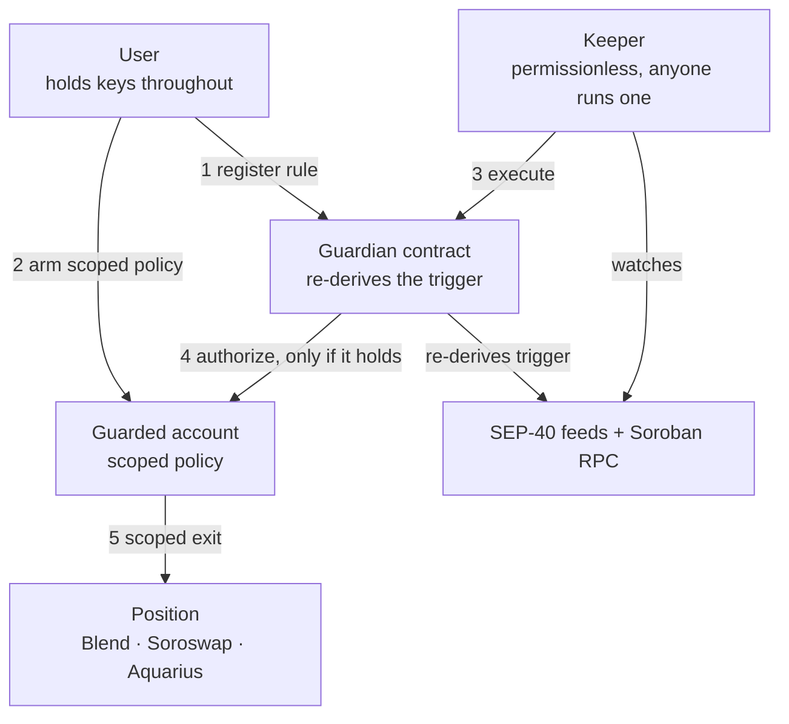

# SoroGuard

Stop-loss and auto-exit for Stellar DeFi. You set a rule on your own position. If it
triggers, a permissionless keeper pulls your funds out before you lose them. Non-custodial:
you keep your keys the whole time.

Soroban has no built-in automation. A contract can't act on its own, so nobody can. Every
other major chain has stop-loss bots and automation networks. Stellar doesn't. SoroGuard is
that missing layer, built so the actor pulling you out can't lie about why.

Status: working implementation with tests. Not yet deployed to a live network, not audited.
Don't use it with real funds.

## Why

On February 22, 2026, an oracle manipulation attack drained about $10.8M from the YieldBlox
pool on Blend. A single trade in an illiquid market moved USTRY from about $1 to $106. The
oracle read that trade as the price. The attacker borrowed against collateral the pool now
badly overvalued, and the pool's depositors were the ones left short.

The root cause was the pool's oracle configuration, not Blend's core contracts. Which means
any pool can be next. Validators later froze about $7.5M of the funds by hand, over a
weekend. No depositor had a way to say "if this position gets dangerous, get me out."

A depositor watching a single feed had nothing to react to; that feed looked internally
consistent the whole way up. A second feed disagreeing by 10,500% is the signal. SoroGuard's
oracle-deviation rule reads exactly that.

## Architecture

Four parts. The guardian and the policy are the security surface. The keeper is replaceable
and trusted with nothing.



- **Guardian** (`contracts/guardian`). Stores each user's rules. Before any action runs it
  re-derives the trigger from live oracle and ledger state. `execute` takes no price from the
  caller, so a keeper has no channel to lie through.
- **Policy** (`contracts/policy`). A Soroban smart account. It scopes a keeper to one
  function on one contract, and only while the guardian confirms the rule holds. The owner
  can revoke at any time. This is what keeps custody with the user.
- **Keeper** (`keeper`). A permissionless off-chain watcher. It reads feeds, spots a
  triggered rule, and submits the exit. Anyone can run one. A wrong or lying keeper wastes
  only its own fee.
- **Rules.** Three types in v1: price stop-loss, lending health-factor floor, and
  oracle-deviation exit.

The keeper and the guardian both read the same feeds. The keeper reads them to decide when to
try; the guardian reads them to decide whether anything happens. Only the guardian's read
authorizes a move.

This needs zero cooperation from Blend, Aquarius, or Soroswap. The keeper calls their public
functions the same way any wallet does, using the user's own authorization routed through the
policy. No partnerships required.

## What the guardian checks before it acts

`execute(rule_id, keeper)` runs these in order and stops at the first that fails. `check`,
which the keeper simulates and the policy consults during `__check_auth`, applies the same
gate and returns a bool.

1. The rule is active. A cancelled rule does nothing.
2. The cooldown since the last firing has elapsed. This is what stops a keeper acting on a
   single-ledger price wick.
3. The trigger holds, re-derived from chain state (`contracts/guardian/src/trigger.rs`):
   - **Price** and **health-factor**: the SEP-40 last price (or the lending adapter's health
     reading) is fresh within the rule's `max_age`, positive, and past the threshold.
   - **Oracle deviation**: two or more feeds for the same asset, normalised to a common
     scale, disagree by more than the rule's `max_bps`.
4. Only then is the position's exit called, and that call is authorized by the user's policy,
   not by the keeper.

The keeper passes a rule id and nothing else. No price, no health factor, no proof. That is
the property the signature enforces: there is no argument through which a keeper could lie.

## A rule

```rust
// A stop-loss on an XLM position, priced through a SEP-40 feed.
Rule {
    owner:    G...,
    position: soroswap_lp,
    trigger:  Trigger::Price(PriceBelow {
        asset:   Asset::Other(symbol_short!("XLM")),
        below:   11_000_000_000_000, // $0.11 at the feed's 14 decimals
        oracle:  sep40_feed,
        max_age: 900,                // reject prices older than this, in seconds
    }),
    action:   Action::ExitToStable(ExitToStable { to: usdc }),
    cooldown: 300,                   // seconds, guards against a single-ledger wick
    // last_fired and status are set by the contract, never the caller
}
```

`register` takes the rule's parts rather than a whole `Rule`, so a caller has no field
through which to set their own `last_fired` or `status`.

## Non-custodial by construction

There is no vault and no custody. Your position stays where it is. The only thing SoroGuard
can do is run the exact exit you defined, when the condition you set actually holds, through a
smart-account policy you can revoke any time. The keeper signs the outer call and pays the
fee; that is the entire extent of its authority. The authority to touch your position comes
from your own account, keyed to a rule id, and only while the guardian still says yes.

The enforcement lives in `contracts/policy/src/lib.rs`. A guarded account has two ways to
authorize a call. An owner signature carries full authority, like any wallet. A rule id
carries none of its own: it reaches one armed function on one armed contract, never the
account's own configuration, and only while the guardian confirms the rule holds. Disarm the
rule and the id buys nothing, whatever a keeper claims.

## Layout

```
contracts/guardian   rules, trigger re-derivation, SEP-40 reads
contracts/policy     smart-account policy scoping the keeper
keeper               off-chain watcher (Rust binary)
site                 project site (static)
```

## Build and test

Rust 1.95+, the `wasm32v1-none` target, and the Stellar CLI for deployment.

```
cargo test --workspace
cargo build --target wasm32v1-none --release -p soroguard-guardian -p soroguard-policy
```

The guardian tests run against a mock SEP-40 feed and cover the security-relevant paths: the
owner-only guards, the cooldown, oracle staleness, a cancelled rule, and a reproduction of
the YieldBlox cross-feed deviation. The policy tests prove a rule can't widen its own scope or
touch the account's configuration. See `contracts/guardian/src/test.rs` and
`contracts/policy/src/test.rs`.

## Run a keeper

```
cp keeper/soroguard.example.toml keeper/soroguard.toml   # then edit it
export SOROGUARD_KEEPER_SECRET=S...                       # never goes in the config
cargo run -p soroguard-keeper -- --config keeper/soroguard.toml --once
```

`--once` sweeps every watched rule and reports what would fire, without submitting. Drop it to
run the loop.

## Status

| Component | State |
|---|---|
| Guardian contract + trigger re-derivation | implemented, tested |
| Policy (smart-account scoping) | implemented, tested |
| All three rule types (price, health, deviation) | implemented, tested |
| Keeper client | implemented; submit path not yet run against live RPC |
| Testnet deployment | next |
| Mainnet | after an audit |

Built in the open. SoroGuard is a rebuild of [avaguard](https://github.com/soloking1412/avaguard-avax),
a circuit-breaker and invariant-monitoring system for Avalanche, adapted to Soroban.

## License

MIT. See [LICENSE](LICENSE).
